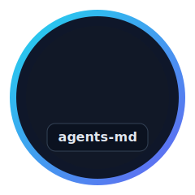

# agents-md



A lightweight **requirements operating system** for AI-assisted project work.

Instead of repeating long setup prompts in every project, keep `agents-md/` as a stable submodule and evolve requirements in your project as versioned deltas.

> `agents-md` is the shared rulebook; your project owns the requirements history.

## What this is (and isn't)
- ✅ **Is:** shared process + constraints (`agents-md/`) reused across projects
- ✅ **Is:** a versioned requirements flow (`requirements/project.vN.md`)
- ❌ **Is not:** a one-off template to copy once and forget

## Files
- `requirements.md` — guideline for drafting initial project requirements (`requirements/project.v1.md`)
- `implementation.md` — organization-wide implementation constraints (shared)
- `instructions.md` — prompt/workflow shortcuts
- `template.md` — integration note (submodule usage)

## Usage
1. Keep this repository at `agents-md/`
   - Recommended: pin it as a git submodule to a release branch
   - Example add command: `git submodule add -b release/v0.3 https://github.com/trace-code-org/agents-md.git agents-md`
2. Maintain **project-specific requirements** as versioned delta files in `requirements/project.vN.md` (see: `agents-md/implementation.md` → **Project Requirements / Versions**)
3. Treat `agents-md/implementation.md` as **organization-wide constraints** that project requirements must satisfy.
4. Let the root `agents.md` in your project reference `agents-md/implementation.md`.

## Simple example prompt you can give your agent

```text
Please implement these requirements with the github.com/trace-code-org/agents-md flow:
- Build a web app that tracks naps for office cats 🐈
- Start/stop nap timer per cat
- Show daily nap leaderboard
- Add a “zoomies detected” event button
```

That’s it. Keep the request simple, and let agents-md apply its framework (requirements flow + implementation constraints).

## v0.3: Breaking change
Project requirement files now live in `requirements/` instead of the project root.
- Old: `project.vN.md`
- New: `requirements/project.vN.md`
